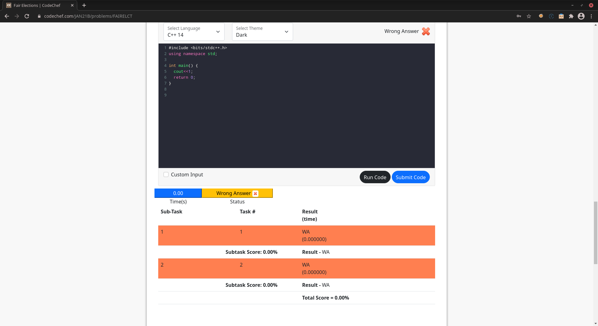

# Codechef Embedded Editor

*Don't like going to next page for submitting problems on codechef again and again? Want some editor embedded in codechef same as hackerearth or leetcode?*

Don't worry, Codechef Embedded Editor is here. Install this extension from [here](build/main.crx).

## Supported Languages
 - C
 - C++14
 - C++17
 - Python2
 - Python3.6 
 - Java

## Usage
Install the extension from [here](build/main.crx) and it will do the rest

## Features
- Auto Save Code(Code is saved in codechef site data only)
- Dark and Light themes
- Syntax highlighting
- Vim and Sublime Keybindings
- Default Code Templates
- Custom Input
- Uses CodeChef API for all the Run and Submit Code

## Screenshots
For more screenshots, See [here](screenshots.md)

## Found any bug?
Feel free to open up issue [here](https://github.com/sarthaksadh01/CodeChef-Embedded-Editor/issues) and we will try to resolve it.

Happy Coding!!
